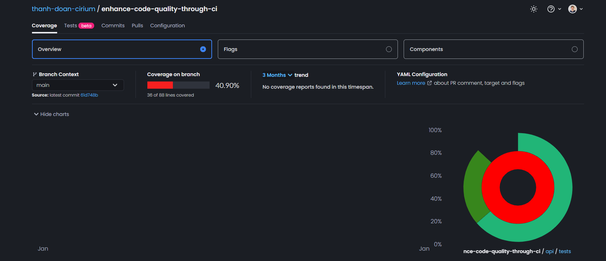
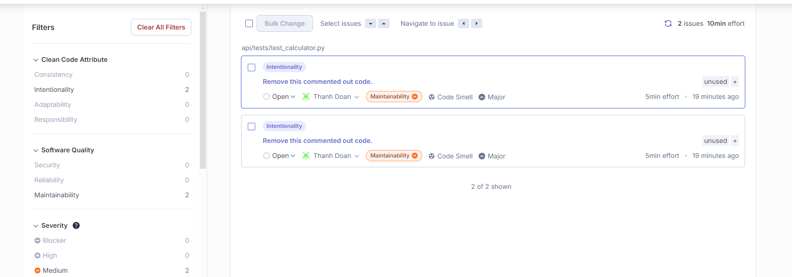
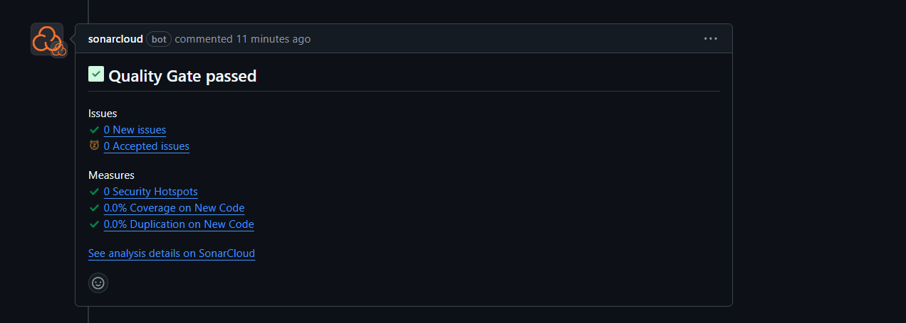

Enhancing code quality through your CI with GitHub Actions

## Summary

There are many ways to enhance the quality of your code, but in this demo, we'll explore three key methods and show you how to integrate them into your CI workflow. Our focus will be on the following areas:

- Code coverage
- Code security
- Code styling

## Demo app

In our the repository, there is a calculator app written in Python and a tests directory that contains our app’s tests.

## Code coverage

In this demo, [CodeCov](https://about.codecov.io/) is used with GitHub Actions. It generates a report that details what percentage of your code is covered by each test, which tests are failing, and which branches aren’t being tested.

You can set up CodeCov in your GitHub Actions workflow easily by following these steps:

- Log in to CodeCov with your GitHub account from [Here](https://app.codecov.io/login/).
- Copy the CODECOV_TOKEN value that will be displayed and add it to your repository’s secrets.

### Examples



## Code styling

In this demo, flake8 is used to check Python styling

## Code security

In this demo, [SonarCloud](https://www.sonarsource.com/) is used

### Requirements

- Create your account on SonarCloud. Sign up for free now if it's not already the case! [SonarCloud Sign up](https://www.sonarsource.com/products/sonarcloud/signup/?utm_medium=referral&utm_source=github&utm_campaign=sc-signup&utm_content=signup-sonarcloud-listing-x-x&utm_term=ww-psp-x)
- The repository to analyze is set up on SonarCloud. [Set it up](https://sonarcloud.io/projects/create) in just one click.

### Usage

Project metadata, including the location of the sources to be analyzed, must be declared in the file `sonar-project.properties` in the base directory:

```
sonar.organization=<replace with your SonarCloud organization key>
sonar.projectKey=<replace with the key generated when setting up the project on SonarCloud>
# relative paths to source directories. More details and properties are described
# in https://sonarcloud.io/documentation/project-administration/narrowing-the-focus/
sonar.sources=.
```

### Some examples




